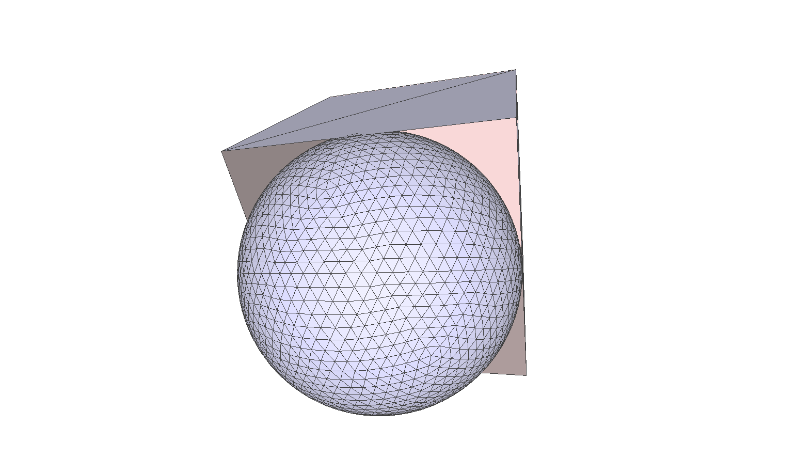
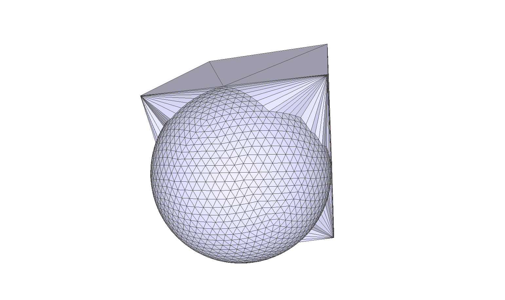

# gpf - A collection of geometric processing function
This library aims to implement some useful geometry processing algorithms purely in rust. The performance of the library is the main pursuit, but I won't sacrifice readability with some complicated tricks for that reason.

## Algorithm
### Mesh Fixing Algorithm
As descried in [Convex polyhedral meshing for robust solid modeling](https://arxiv.org/abs/2109.14434), We can repair any defective mesh into a watertight solid.

For a cube whose front face is eliminated and a sphere, as shown above, we want to combine them into a solid.
```rust
fn read_obj(name: &str) -> (Vec<f64>, Vec<usize>) {
    let (models, _) =
        tobj::load_obj(name, &tobj::LoadOptions::default()).expect("Failed to load obj file");
    let model = &models[0];
    let points = model
        .mesh
        .positions
        .iter()
        .map(|x| *x as f64)
        .collect::<Vec<_>>();
    let triangles = Vec::from_iter(model.mesh.indices.iter().map(|x| *x as usize));
    (points, triangles)
}

fn test_cube_and_sphere() {
    // read cube and sphere
    let (cube_points, cube_tris) = read_obj("tests/data/cube.obj");
    let (sphere_points, sphere_tris) = read_obj("tests/data/sphere.obj");

    // merge cube and sphere into one mesh
    let n_cube_points = cube_points.len() / 3;
    // merge points
    let points = Vec::from_iter(cube_points.into_iter().chain(sphere_points));
    let tri_in_shells = Vec::from_iter(
        // cube is the first shell
        vec![0; cube_tris.len() / 3]
            .into_iter()
            // sphere is second shell
            .chain(vec![1; sphere_tris.len() / 3]),
    );
    // merge triangles
    let triangles = Vec::from_iter(
        cube_tris
            .into_iter()
            .chain(sphere_tris.into_iter().map(|idx| idx + n_cube_points)),
    );
    let (new_points, new_triangles) =
        make_mesh_for_triangles(&points, &triangles, &tri_in_shells);
    write_obj(&new_points, &new_triangles, "123.obj");
}
}
```
Finally, we get a watertight mesh.


You can try it [online](https://view-nine.vercel.app/).

### Boolean algorithm
TODO..
